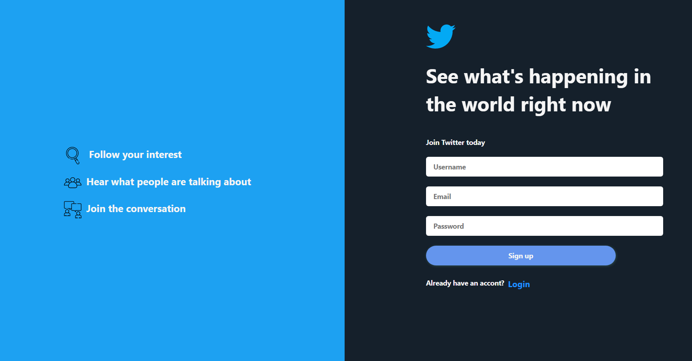
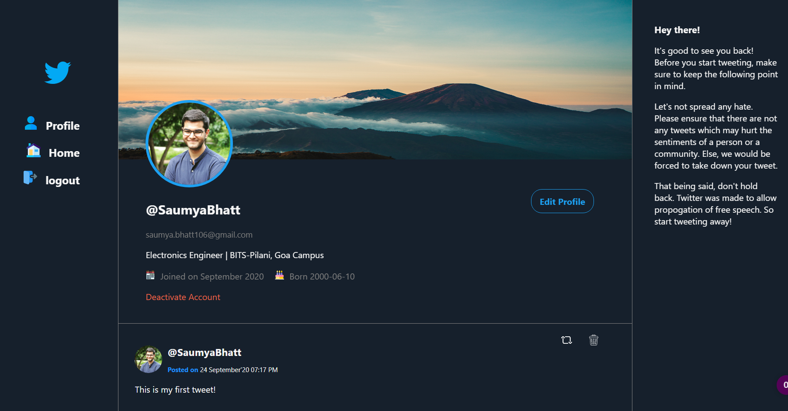
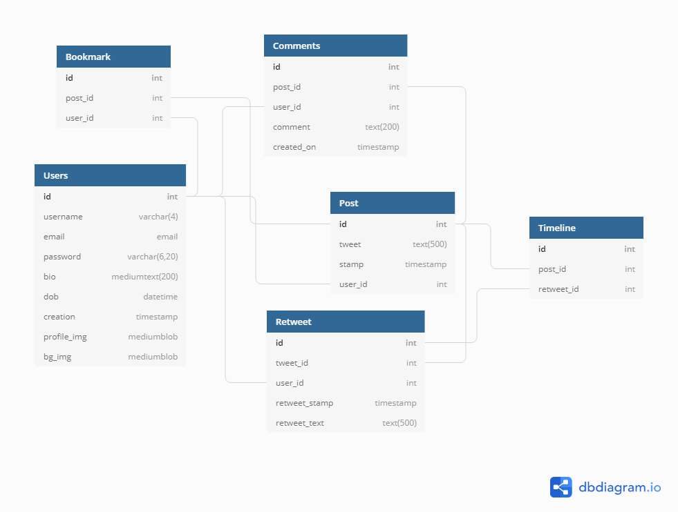

# Fullstack Twitter Clone

Made using the python framework Flask, this is a frontend + backend clone of twitter. Of course, it does not have ALL the functionalities Twitter has, but it can do the functions that are quintescential to Twitter, namely:

1. Login and logout functionalities with a login and cookie manager system.
2. Creating own account and update and customize (with setting own profile pictures and image management system).
3. CRUD operations on all your tweets.
4. Retweeting other perople's tweets.
5. Looking up other users profile.

  

# Screenshots

Have tried to keep the UI as similiar as that of Twitter. Is not mobile responsive yet so is better to view it in landscape on laptop or desktop. The reason this hasn't been done yet is that this project's primary purpose was not to create a fronend site but rather create a fully functional generic social media website

 

Welcome login/signup page
  

Home page
  

User account page
  

# Database Schema

According to the current functionalities there are 5 tables in the schema. The User has all the info on the user, the Post links the creted posts to their author as:  

    User.id --> {author} --> Post.user_id

The Retweets have a different table that the Posts as they point to instances within the Post themselves. Their connection is given as:  

    Post.id --> {ori_post} --> Retweet.tweet_id
    User.id --> {retwitter} --> Retweet.user_id

The Timelinr table keeps track of all the posts and the retweets that were created since day zero. Their relationship is given as:  

    Post.id --> {from_post} --> Timeline.post_id
    Retweet.id --> {from_retweet} --> Timeline.retweet_id

 

__NOTE :__ This portion is yet to be implemented  
The Bookmark Table joins the User table with the Posts that the user saves. Relationship given as:  

    User.id --> {by_user} --> Bookmark.user_id
    Post.id --> {saved_post} --> Bookmark.post_id

 
The complete schema structure is given below:

 

__To Access the database in more detail, go [here](https://dbdiagram.io/d/5f7185f53a78976d7b757403)__

  

# Note

1. The database has been built on SQLite browser using SQLAlchemy so is not currently scalabe. But due to Flask's upwards compatibility, can be shifted to PostgreSQL whenever needed.
2. The login management system hashshes the passwords and follows a strict cookie management and uses flask_login_manager to time the user sessions and hence provides intermediate level of protection.
3. Built using a virtual environmen so can be easily downloaded and run on your local machine.

 

## To run on your machine

 

    1. Download/clone this repository to your local machine
    2. In the project repository create a virtual environment - `pipenv shell` [Make sure you have pipenv and python installed on your machine]
    3. In the commandline run `pipenv install` . It will automatically install all the required modules to run.
    4. To start the server, typr on the command line - `python run.py` . Will automatically start a server running @localhost:5000

 

## Test User Credentials

1. Username : JaneDoe
2. Email : test@test.com
3. Password : Admin123

  

# Things yet to do

1. Add follow user/following functionality.
2. Add ability to like posts
3. Add bookmark posts to database.
4. Add 'forgot password' functionality.
6. Optimizing storage if tweet images

  

# Contributing

Although this is not a fully fledged open source project, it never hurts to get some help :)
Go through the Issues listed. Most of them are beginer friendly and should be good enough for your first PR!
